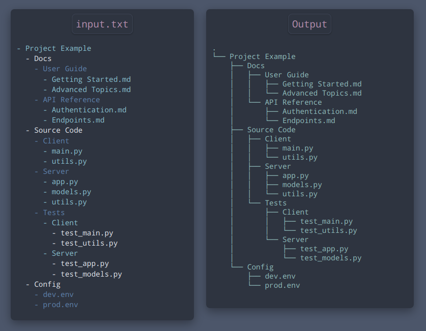

<div align="center">
  <p>
    
  </p>
  <hr>
  
  Convert list to directory tree.
  
</div>

<br>

<div align="center" style="border-radius:6px;">
  <p>
    
  </p>
</div>
<br>

Md-Tree is a Python program that takes in a markdown-style list from a file and generates a tree, similar to the `tree` command on Unix. It's a useful tool for visualizing and planning the structure of your directory or project, ahead of time, in an easy-to-read format.


## Features

- Ouputs markdown-style lists as a tree
- Supports multiple file formats, including `.md`, `.txt`, and more

## Usage

```shell
python main.py --file ~/path/to/file.txt
```

### Important Notes

- For the input list, it is recommended to use tabs for indentation, and `-` to indicate the beginning of an list-item.
- Make sure the list in the input file doesn't have any **blank** lines; this includes making sure the file doesn't end with one either.

#### TODO
- Make it efficient (runs in `O(n^2)` atm) and remove redundant checks/conditions.

